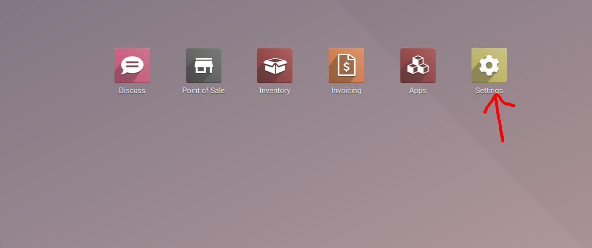
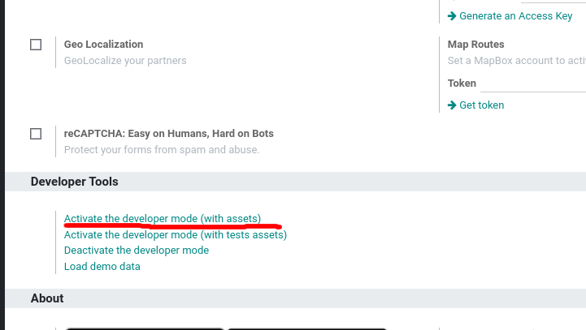
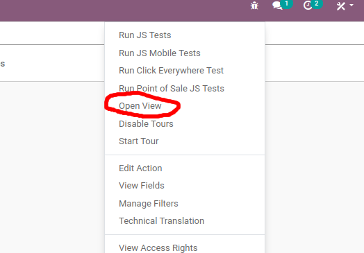
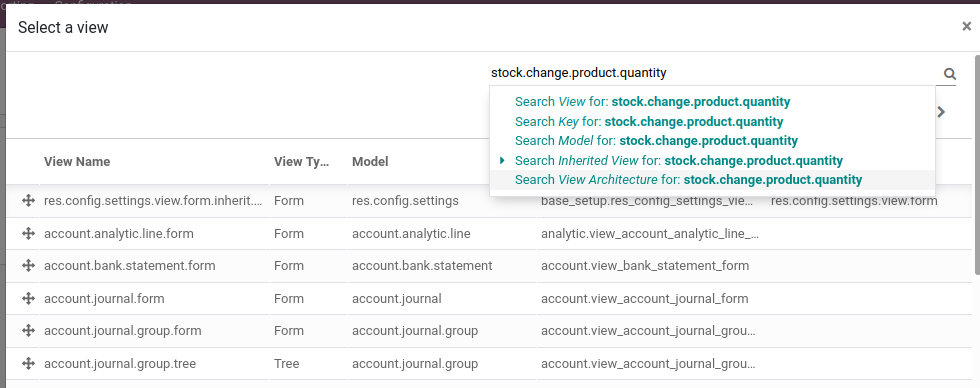
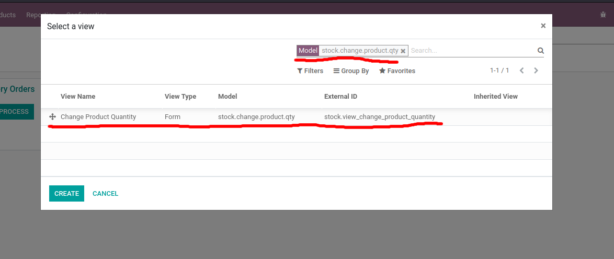
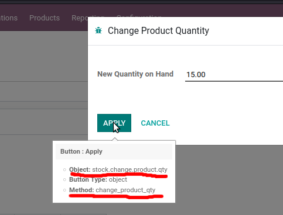
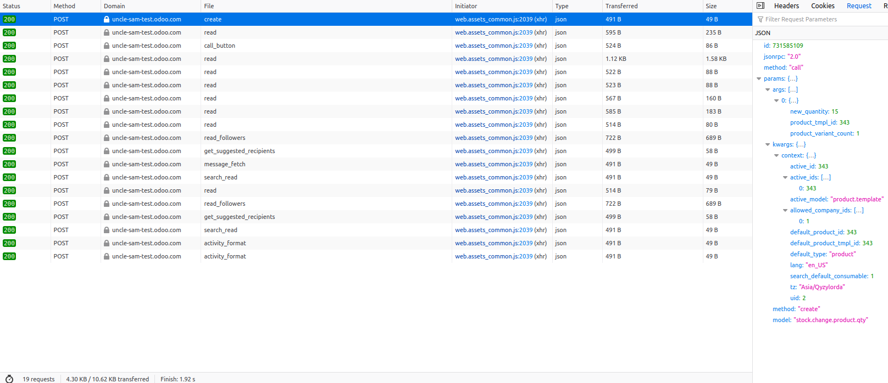
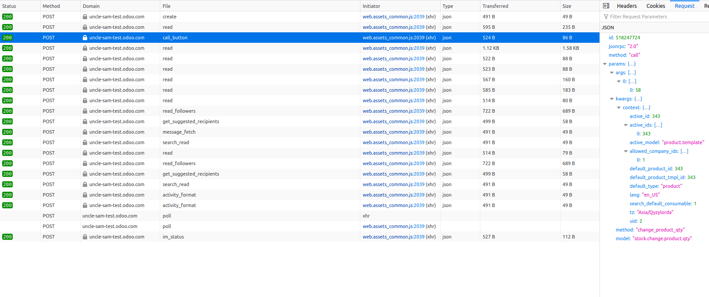
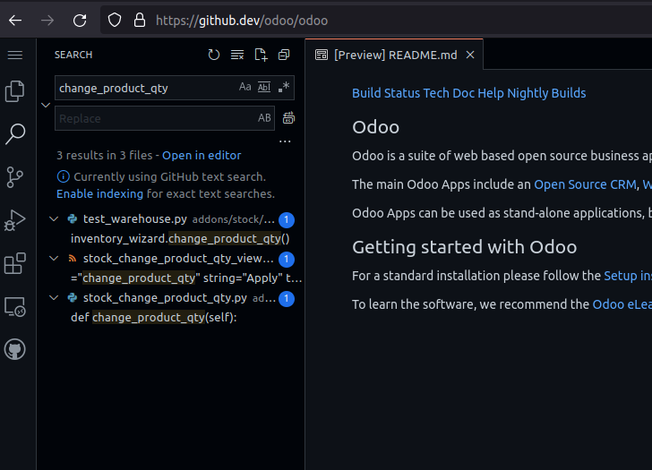

# About this repo

this repo serves as a test for interacting with odoo's API from a NodeJS environment using the xmlrpc package.

It Implements:

- querying for database version
- authentication
- searching for products
- updating quantity at hand of a product

to run need to set env variables

- **HOST:** url of odoo instance. ex: demo.odoo.com.
- **DB:** name of DB instance. ex: demo.
- **USERNAME:** account username/email.
- **API_KEY:** API key generated from instance. alternatively can use password.

# Using ODOO External API

## Odoo uses an XML-RPC API

To learn more about xml-rpc visit https://en.wikipedia.org/wiki/XML-RPC

## Resources for learning how to use the API

### 1. External API documentation

Can be found here: https://www.odoo.com/documentation/14.0/developer/misc/api/odoo.html

### 2. Turn on developer mode

1. Go to setting
   
2. Turn on developer mode
   
3. Click bug icon on nav and click open view
   
4. Explore available view and models
   
   
5. Hover over buttons to get details of what methods they call and what objects the use
   

### 3. Use browser dev tools to examine network calls

check the network calls made check the method name, model, args and kwargs

### 4. Explore the code repositoy

1. navigate to the odoo code repo (https://github.com/odoo/odoo)
2. press the period key to open a vscode instance in the browser
3. use the search function find where methods and objects are defined
   
